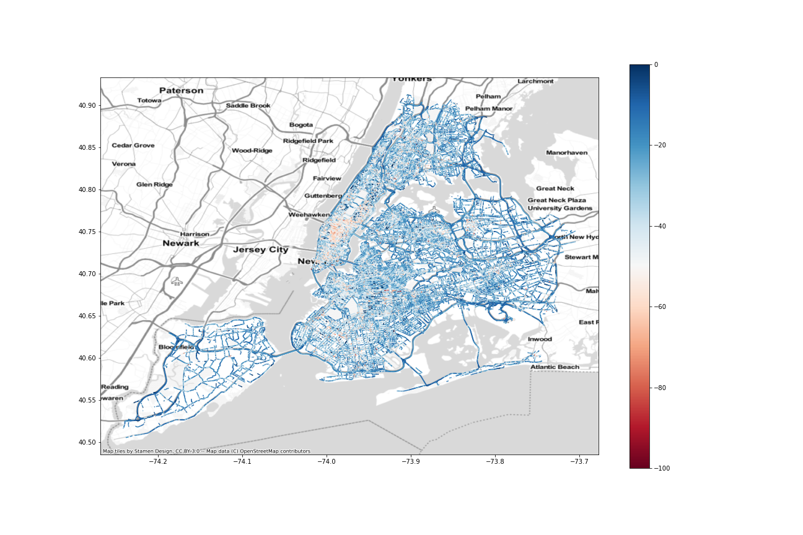

# Intro to Uber Movement Data

**Authors:** Alex Michels and Jinwoo Park

*Map of NYC traffic speed as a percentage of free flow*

This notebook provides a brief overview of Uber Movement Data, demonstrates how to obtain and work with it, and illustrates a few examples of how to utilize the data for geospatial analysis.

